# ECHO 交互流程图

## 一、核心场景流程图

### 1. 「播种」仪式 - 上传作品流程

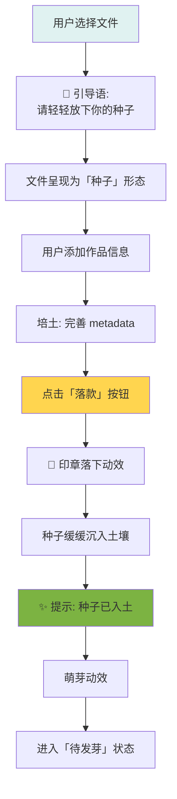

---

### 2. 「结缘」体验 - 购买授权流程

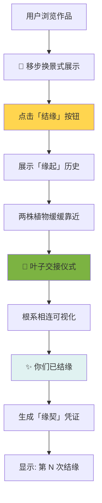

---

### 3. 「收获」仪式 - 收益提取流程

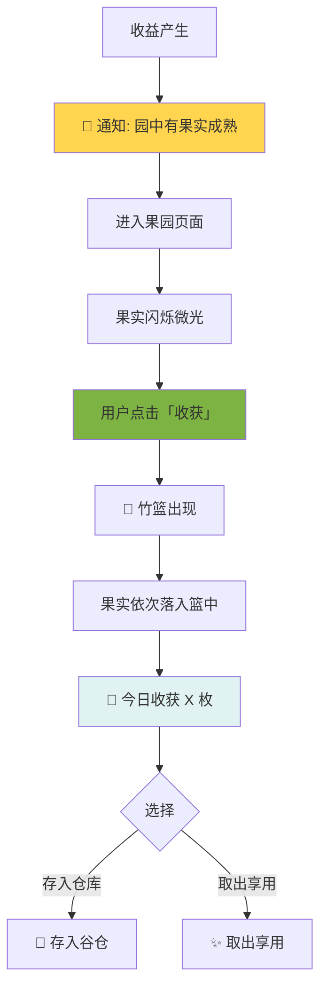

---

### 4. 「生长」脉动 - 作品被使用反馈

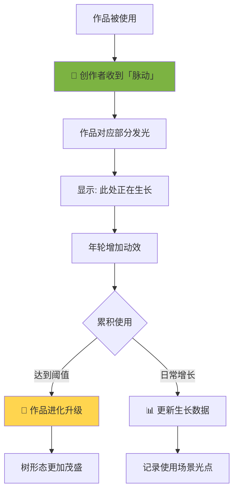

---

## 二、用户旅程地图

### 创作者旅程

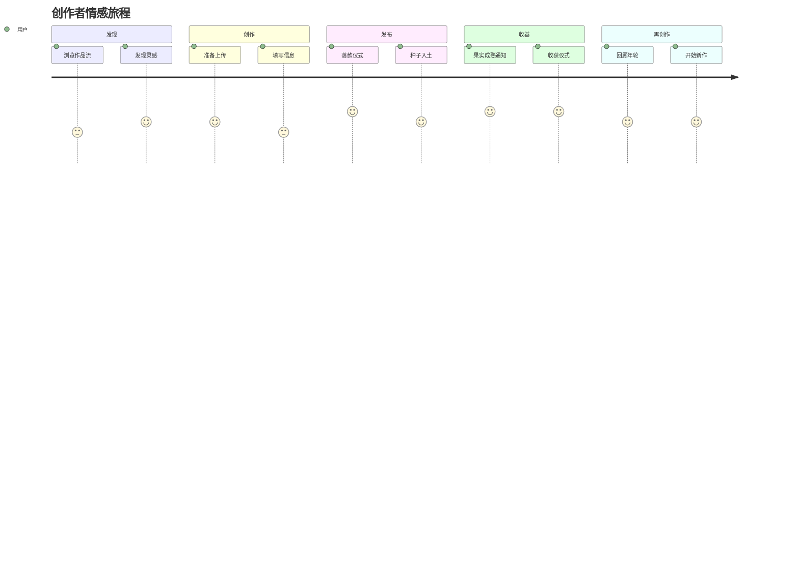

### 购买者旅程

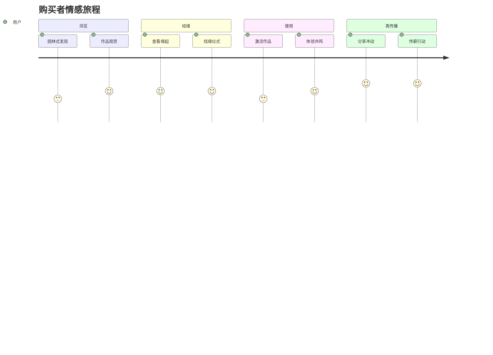

---

## 三、空状态流程

### 待开垦状态

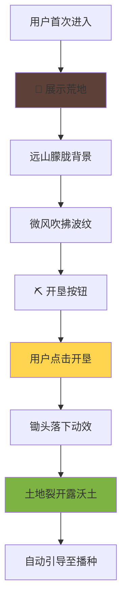

### 种子未发芽状态

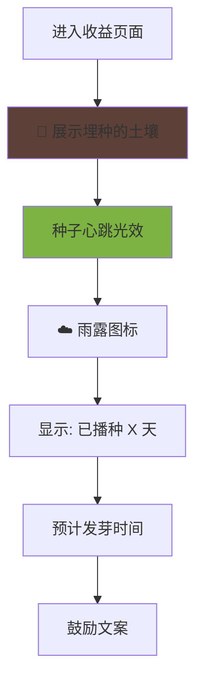

### 生长中加载状态

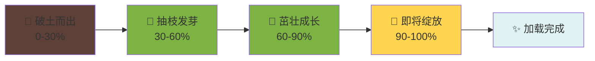

---

## 四、仪式感详细流程

### 落款仪式

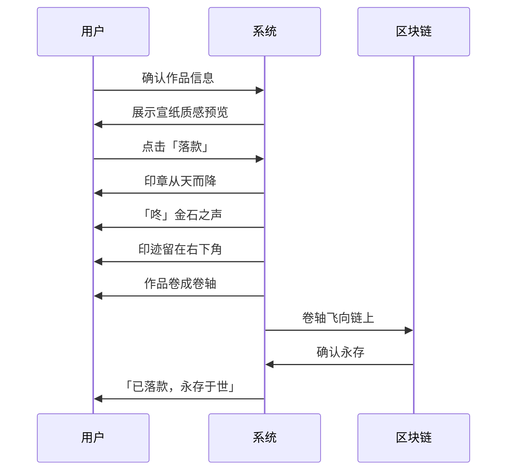

### 交接仪式

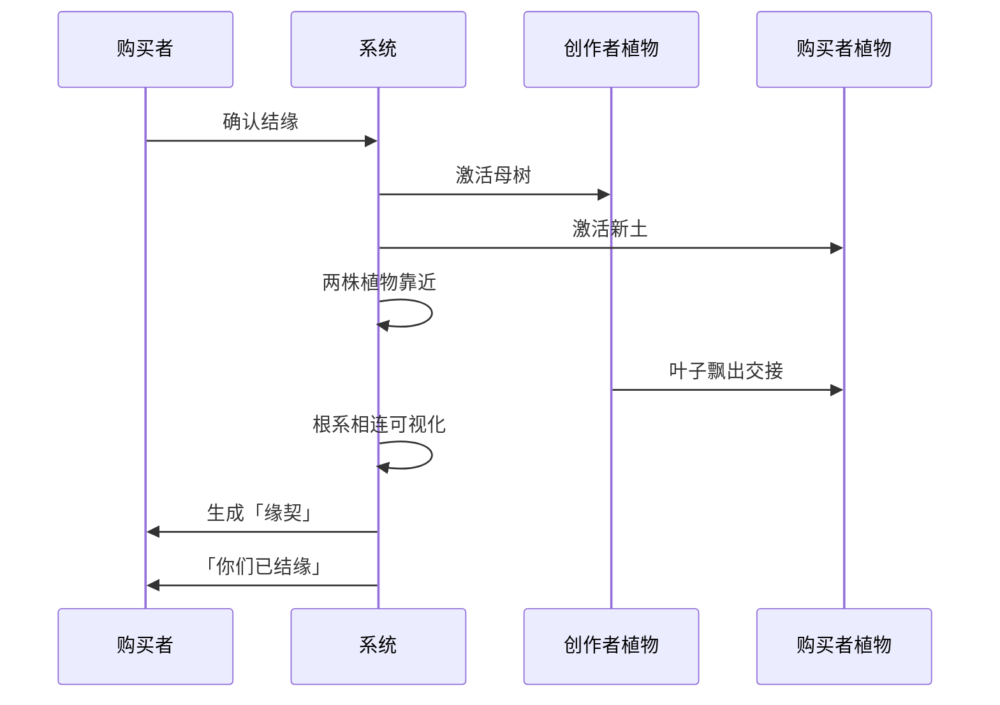

### 收获仪式

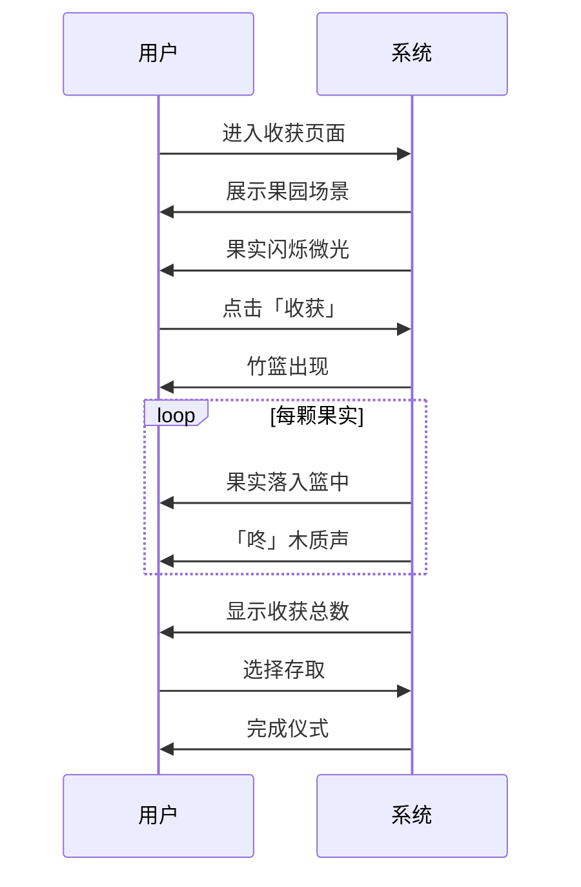

---

## 五、情感峰值点标注

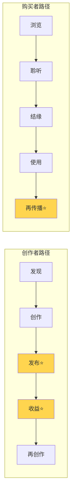

---

*流程图设计说明：*
- ⭐ 标记为情感峰值点
- 所有流程强调「渐进、含蓄、意在言外」
- 每个节点都有「余韵」设计
